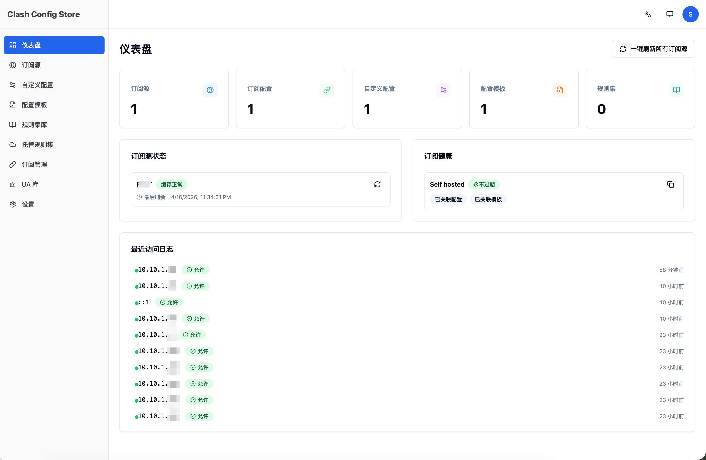
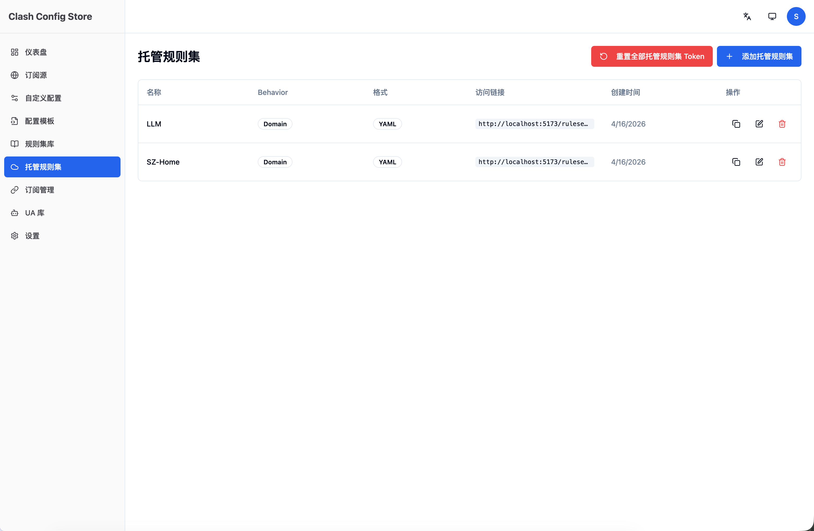
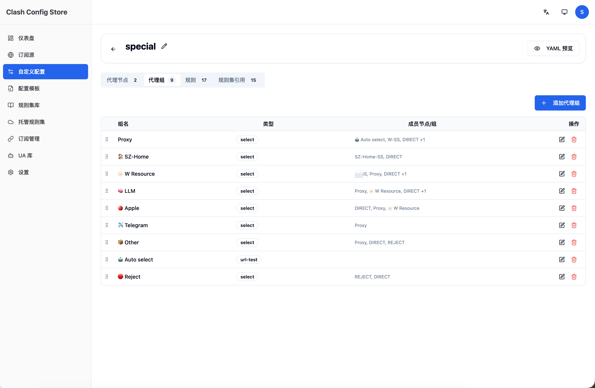
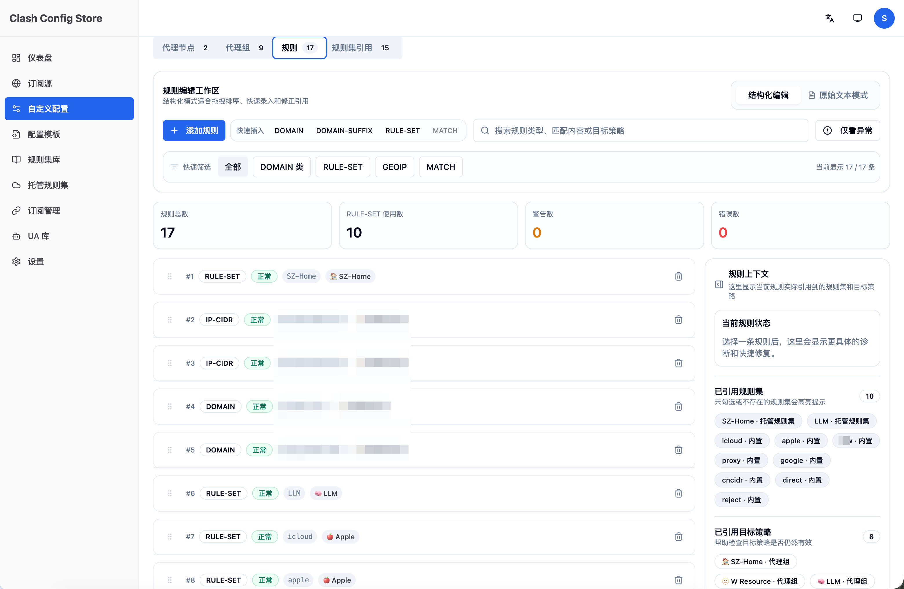

# Clash Config Store

Clash Config Store 是一个面向 Mihomo/Clash 的订阅编排与分发平台：  
把多个上游代理订阅、规则集和自定义配置统一管理，最终生成可直接下发的完整 YAML。

## 这个项目做什么

- 统一管理上游订阅源（Provider），支持缓存、手动刷新、UA 定制
- 提供可复用的「配置模板」「规则集库」「托管规则集」
- 支持可视化编辑自定义配置（`proxies` / `proxy-groups` / `rules`）
- 生成带 Token 的订阅链接（`/sub/{token}`），支持重新生成与过期控制
- 提供访问限制（IP / CIDR / 国家）和访问日志
- 支持中英文界面、深浅色主题

### 界面截图

| 首页 | 托管规则集 |
|---|---|
|  |  |

| 自定义配置 - 代理组 | 自定义配置 - 规则 |
|---|---|
|  |  |


## 技术栈与结构

- 后端：Go 1.25、Gin、GORM、JWT
- 前端：React + TypeScript + Vite + Tailwind + shadcn/ui
- 数据库：SQLite（默认）或 MySQL/MariaDB
- 部署形态：单后端容器（同时提供 API + 前端静态资源）

目录概览：

```text
cmd/server/main.go         # 程序入口、路由注册
internal/                  # 后端核心代码（handler/service/model 等）
frontend/                  # 前端工程
docker-compose.yml         # 默认部署编排（SQLite）
Dockerfile                 # 多阶段构建镜像
```

## 怎么用

### 1. Docker Compose（推荐）

```bash
git clone https://github.com/PrintNow/clash-config-store.git
cd clash-config-store

cp .env.example .env
# 编辑 .env，至少修改 JWT_SECRET

# 可选：如果要把 SQLite 文件映射到宿主机文件，建议先创建
touch ./clash-config-store.db

docker compose up -d --build
```

默认访问地址：

- Web UI: `http://localhost:26406`
- API: `http://localhost:26406/api`
- 公开订阅: `http://localhost:26406/sub/<token>`

说明：

- 默认 `docker-compose.yml` 使用 SQLite（`DB_TYPE=sqlite`）
- 如需外部 MySQL/MariaDB，请在 `.env` 设置：
    - `DB_TYPE=mysql`
    - `DB_DSN=<mysql dsn>`

### 2. 本地开发运行

后端：

```bash
cp .env.example .env
# 编辑 .env，至少修改 JWT_SECRET

go mod tidy
go run ./cmd/server
```

前端（另开终端）：

```bash
cd frontend
npm install
npm run dev
```

开发访问：

- 前端 Dev Server: `http://localhost:5173`
- Vite 已内置代理到本地后端（`/api`、`/sub`、`/ruleset`）

## 核心使用流程

1. 注册并登录账号
2. 在「UA 库」中维护常用 User-Agent（可选）
3. 在「订阅源」中添加上游订阅 URL
4. 在「规则集库 / 托管规则集 / 配置模板 / 自定义配置」中按需建模
5. 在「订阅管理」中新建订阅并绑定来源与配置
6. 复制订阅链接并导入 Mihomo/Clash 客户端

## 基础二次开发

### 后端扩展（新增一个资源接口）

建议按现有分层：

1. 在 `internal/model` 定义模型
2. 在 `internal/handler` 增加请求处理函数
3. 在 `cmd/server/main.go` 注册路由
4. 需要时在 `internal/service` 编排业务逻辑
5. 运行 `go test ./...` 验证

### 前端扩展（新增一个页面）

建议流程：

1. 在 `frontend/src/pages` 新增页面组件
2. 在 `frontend/src/api` 增加 API 模块
3. 在 `frontend/src/components/layout/Sidebar.tsx` 添加导航项
4. 在 `frontend/src/i18n/locales/zh.ts`、`frontend/src/i18n/locales/en.ts` 补齐文案
5. 运行 `cd frontend && npm run build` 做类型与构建校验

### 配置合成相关开发建议

- 订阅下发入口：`GET /sub/:token`
- 托管规则集入口：`GET /ruleset/:token/:name`
- 涉及 YAML 生成/规则拼接时，建议同步补充单元测试，避免配置回归

## 环境变量（常用）

| 变量                 | 默认值                                       | 说明                     |
|--------------------|-------------------------------------------|------------------------|
| `APP_PORT`         | `26406`                                   | 服务监听端口                 |
| `DB_TYPE`          | `sqlite`                                  | `sqlite` 或 `mysql`     |
| `DB_DSN`           | `clash-config-store.db`                   | SQLite 文件路径或 MySQL DSN |
| `JWT_SECRET`       | `please-change-this-secret-in-production` | JWT 密钥，生产环境必须修改        |
| `JWT_EXPIRY_HOURS` | `24`                                      | JWT 有效期（小时）            |
| `BASE_URL`         | `http://localhost:26406`                  | 用于生成订阅链接               |
| `GEOIP_PATH`       | 空（自动探测）                                   | GeoLite2 数据库路径，用于地理限制  |

## GeoIP（可选）

- 项目支持按国家进行访问限制，依赖 GeoLite2 数据库
- `make geoip` 可下载 `GeoLite2-City.mmdb` 到 `.docker/geoip/`
- Docker 镜像构建阶段默认会下载并放置到 `/data/clash-config-store.d/GeoLite2-City.mmdb`

## 免责声明

- 本项目仅用于配置管理与技术研究，请遵守你所在地区的法律法规和服务条款。
- 使用者应自行确保订阅来源、规则内容与分发行为具备合法授权；由此产生的法律风险与责任由使用者承担。
- 请勿将本项目用于任何未授权访问、攻击、滥用网络资源或其他违法违规用途。
- 项目默认不提供商业支持、可用性保证或数据完整性担保，生产使用前请自行评估并做好备份、监控与访问控制。
