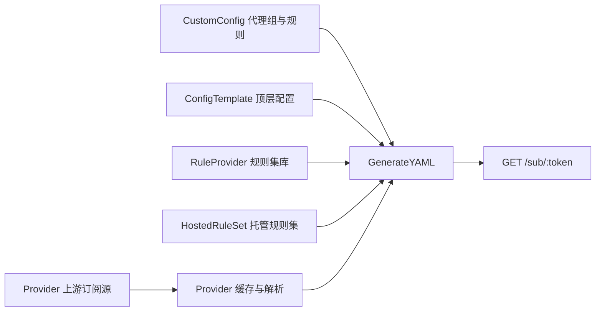

# 订阅生成数据流

本文档说明从用户配置到最终下发 YAML 的主链路，帮助 agent 避免在订阅相关任务中重复探索。

## 主流程

## 关键文件

- 公开订阅入口：`internal/handler/sub.go`
- 订阅 API：`internal/handler/subscription.go`
- 订阅生成服务：`internal/service/subscription.go`
- Provider 拉取缓存：`internal/service/provider.go`
- Mihomo YAML 组装：`internal/util/yaml.go`
- 自定义配置导入/导出/预览：`internal/handler/custom_config.go`

## 资源职责

- `Provider`：保存上游订阅 URL、缓存内容、缓存时间和拉取错误。
- `CustomConfig`：保存结构化 `proxies`、`proxy_groups`、`rules` 和规则集引用。
- `ConfigTemplate`：保存顶层 mihomo YAML，例如端口、DNS、TUN、嗅探等。
- `RuleProvider`：保存系统预设或用户外部规则集元数据。
- `HostedRuleSet`：保存用户托管的规则集内容，并通过公开链接提供给客户端。
- `Subscription`：把上述资源绑定到一个 token 下，生成最终订阅链接。

## 常见任务提示

- 改输出 YAML 字段：先看 `internal/util/yaml.go`。
- 改订阅绑定行为：先看 `internal/handler/subscription.go` 和 `internal/service/subscription.go`。
- 改 Provider 缓存刷新：先看 `internal/service/provider.go`。
- 改导入示例配置：先看 `internal/handler/custom_config.go`，避免携带实例相关 ID。
- 改前端订阅流程：先看 `frontend/src/pages/SubscriptionDetail.tsx` 和 `frontend/src/api/subscriptions.ts`。

## 兼容性提醒

- `/sub/:token` 是用户导入到客户端后的稳定链接，改动 token 行为或响应格式要谨慎。
- 规则集名称会进入最终 `rule-providers` 映射，名称冲突会影响生成。
- 自定义配置中的 `use` 引用 Provider 名称，订阅中未启用对应 Provider 时，最终 YAML 可能缺少节点来源。
